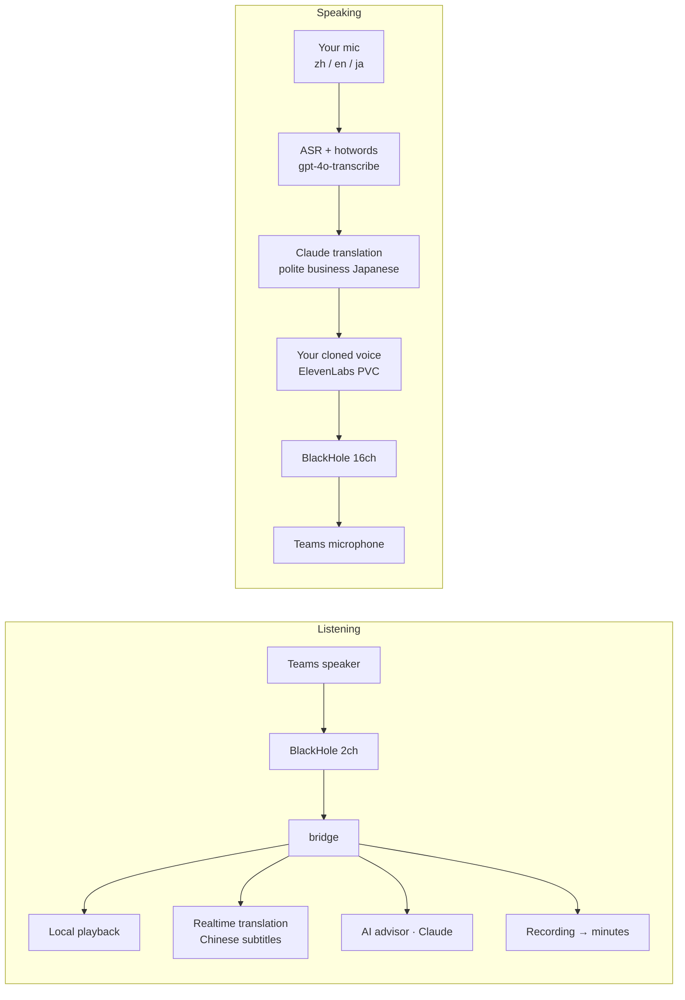

# Meeting Speaking Translate 🎧

> **Speak in meetings in Japanese — with your own voice.**
> A Mac-native real-time interpreter for Teams/Zoom: live subtitles in, your cloned voice out.

[](https://github.com/eyeoooo/meeting-speaking-translate/actions/workflows/ci.yml)
[](LICENSE)
-black)


**[中文文档 →](README.zh-CN.md)**（工程日志与运维文档均为中文）

---

When your counterpart speaks Japanese, you read **live Chinese subtitles**
plus AI advisor hints. When you speak — in Chinese, English, *or* Japanese —
the meeting hears **your own cloned voice speaking polite business Japanese**,
about 2 seconds behind you. Everything is recorded; minutes are generated
automatically after the call.

No plugins in Teams/Zoom. Audio is routed through the BlackHole virtual
sound card; the meeting app just sees a speaker and a microphone.



## Why this exists

Off-the-shelf speech-to-speech translation kept failing in real meetings:
digits got rewritten (*"no more than 5%"* became *"10%"*), mixed-language
sentences collapsed, and conversational models would **answer questions on
my behalf** instead of translating them. This project rebuilds the speaking
pipeline as a cascade — ASR with hotword injection, LLM translation with a
strict "translate, never respond" contract, and voice cloning — then wraps
it in **eight deterministic guardrails** so the model can only do the one
thing it's good at: translating complete sentences.

## Highlights

- 🗣️ **Your voice, in Japanese** — ElevenLabs professional voice clone;
  output is always Japanese regardless of input language
  (zh/en → translated, ja → passed through verbatim, mixed → merged)
- 🔢 **Numbers survive** — digit strings bypass the LLM entirely and are
  rendered in code（「1、2、3、4、5」）; validated with a synth→ASR
  "machine ear" loop so TTS actually *reads them as Japanese*
- 🛡️ **Eight deterministic guardrails** — self-echo (playback-window
  correlated), stale-utterance drop, noise sentinel (∅), hallucination
  rate gate, hangul firewall, dedupe, digit passthrough, translator
  watchdog (a hung API call can never silence the rest of the meeting)
- 📺 **Native floating subtitles** — dual independent lanes (source ↔
  translation are *never* line-paired; the protocol has no pairing field),
  with gray draft text streaming in before sentences finalize
- 🧠 **AI meeting advisor** — reads only the counterpart's speech,
  never your own, never the translations
- 🎛️ **Menu-bar native app** — bundled Python runtime (no Homebrew Python
  needed), one-click rehearsal mode that plays only into your headphones
- ⏱️ **~2s end-to-end speaking latency** — streaming translation feeds TTS
  as soon as the first sentence completes; burst prebuffer tuned to 150 ms

## Engine verdicts (from adversarial human replays)

Every speaking engine went through corpus A/B *and* live human re-validation
(full logs in [docs/speak-engine-ab-20260731.md](docs/speak-engine-ab-20260731.md), Chinese):

| Engine | Verdict |
|---|---|
| `cascade` (ASR + Claude + your voice) | ✅ **Shipped** — menu "My voice"; survived digit traps, mixed-language input, echo loops |
| `translate` (OpenAI Realtime translations) | CLI default & fallback — structurally cannot "answer back", but occasionally rewrites digits |
| `clone` (translate text + cloned voice) | Kept as A/B control |
| `expressive` (conversational realtime + stock voice) | ❌ **Permanently banned** — fabricated dialogue turns ("*はい、調整してみます*") when it heard echo. A translator that answers for you is a red line. |

## Quick start

Requirements: Apple Silicon Mac, macOS 14+, Teams/Zoom running locally.

```bash
git clone https://github.com/eyeoooo/meeting-speaking-translate.git
cd meeting-speaking-translate
brew install blackhole-2ch blackhole-16ch switchaudio-osx

# API keys (~/.zshenv)
export OPENAI_API_KEY=...        # subtitles + speech recognition
export ANTHROPIC_API_KEY=...     # advisor, minutes, cascade translation
export ELEVENLABS_API_KEY=...    # your cloned voice (optional)
export ELEVENLABS_VOICE_ID=...   # create a voice clone at elevenlabs.io

# Build the menu-bar app (bundles its own Python runtime)
cd app && ./build-apps.sh meeting
open ~/Applications/会议助手.app
```

In Teams: **Speaker → `BlackHole 2ch`**, **Microphone → `BlackHole 16ch`**.

Optional, recommended: nobody remembers which BlackHole is which in the
Teams picker. This wraps each one in a friendly-named aggregate device
(pure macOS mechanism — audio and the bridge's device matching are
unaffected):

```bash
swift tools/make_named_devices.swift
```

Then pick **会议助手·扬声器** as the speaker and **会议助手·麦克风** as the
microphone instead. Custom names via `--speaker-name` / `--mic-name`
(must not contain "BlackHole"); `--undo` removes them.

Then click *Start this meeting* in the menu bar. Try speaking safely first
with *Rehearsal* mode — your Japanese plays only into your own headphones.

Full setup, ops runbooks and troubleshooting: **[中文文档](README.zh-CN.md)**.

## Engineering culture

This repo is also an experiment in evidence-driven agent-assisted
development. Some rules that shaped it:

- **Real-device acceptance** — every change is validated on the production
  Mac with replay corpora before merging; commit messages carry the evidence
- **Tests only get stronger** — 242 tests and counting; a spec, once pinned,
  is never weakened
- **Machine-ear loop** — anything that affects speech output is verified by
  synthesizing audio and blind-transcribing it back
- **Determinism over model judgment** — anything that *can* be code
  (digits, echo, staleness, dedupe) *is* code; the LLM only translates
- The `docs/` folder is a running lab notebook (Chinese) of every verdict,
  failure and fix — including the ones that got engines banned

## License

[MIT](LICENSE)
